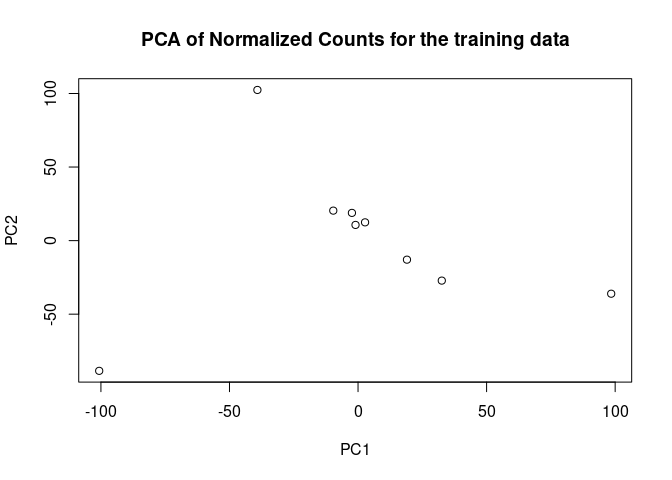

Machine learning using RNAseq data
================
Alsu
February-March 2024

## Data preparation

``` r
library(janitor)
```

    ## 
    ## Attaching package: 'janitor'

    ## The following objects are masked from 'package:stats':
    ## 
    ##     chisq.test, fisher.test

``` r
library(tidyverse)
```

    ## ── Attaching core tidyverse packages ──────────────────────── tidyverse 2.0.0 ──
    ## ✔ dplyr     1.1.4     ✔ readr     2.1.5
    ## ✔ forcats   1.0.0     ✔ stringr   1.5.1
    ## ✔ ggplot2   3.5.0     ✔ tibble    3.2.1
    ## ✔ lubridate 1.9.3     ✔ tidyr     1.3.1
    ## ✔ purrr     1.0.2

    ## ── Conflicts ────────────────────────────────────────── tidyverse_conflicts() ──
    ## ✖ dplyr::filter() masks stats::filter()
    ## ✖ dplyr::lag()    masks stats::lag()
    ## ℹ Use the conflicted package (<http://conflicted.r-lib.org/>) to force all conflicts to become errors

``` r
setwd("/cloud/project/data/")  

normalized.counts.ibd <- read.table(file="Normalized_Count.csv",
                             sep="",
                             header=T,
                             fill=T,
                             check.names=F)

# Transpose data frame
data <- t(normalized.counts.ibd)

# Move the gene names as headers, add column for status
data <- data %>%
  row_to_names(row_number = 1) %>%
  as.data.frame() # %>%
 # mutate(status = c(rep("Control", 6), rep("Parkinsons", 8)))
```

``` r
#install.packages('rsample')

library(rsample)

# Fix random numbers by setting the seed 
# Enables analysis to be reproducible when random numbers are used 
set.seed(123)
# Put 80% of the data into the training set 
data_split <- initial_split(data, prop = 0.70) #strata = status)
# Create data frames for the two sets:
train_data <- training(data_split)
test_data  <- testing(data_split)
```

## Dimensionality reduction

``` r
#convert character dataframe to numeric
train_data <- as.data.frame(sapply( train_data , as.numeric))

# Identify constant or zero columns
train_data_transposed_cons <- sapply(train_data, function(x) is.atomic(x) && length(unique(x)) == 1)

# Remove constant or zero columns
train_data_transposed_no <- train_data[, !train_data_transposed_cons]

# Run PCA
pca_train_result <- prcomp(train_data_transposed_no, scale. = TRUE)

# Plot PCA results
plot(pca_train_result$x[,1], pca_train_result$x[,2], 
     xlab = "PC1", ylab = "PC2", 
     main = "PCA of Normalized Counts for the training data")
```

<!-- -->
