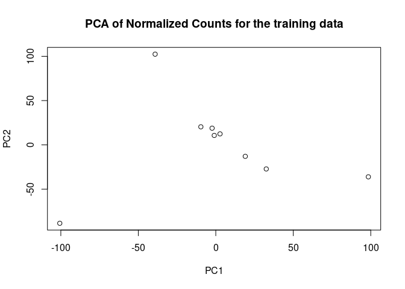
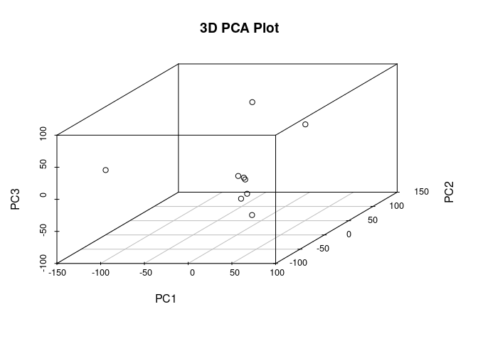
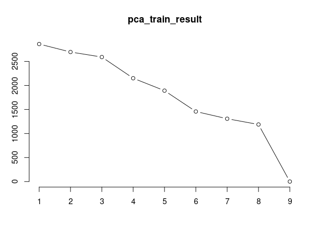

Machine learning using RNAseq data
================
Alsu
February-March 2024

# Data preparation

``` r
library(janitor)
```

    ## 
    ## Attaching package: 'janitor'

    ## The following objects are masked from 'package:stats':
    ## 
    ##     chisq.test, fisher.test

``` r
library(tidyverse)
```

    ## ── Attaching core tidyverse packages ──────────────────────── tidyverse 2.0.0 ──
    ## ✔ dplyr     1.1.4     ✔ readr     2.1.5
    ## ✔ forcats   1.0.0     ✔ stringr   1.5.1
    ## ✔ ggplot2   3.5.0     ✔ tibble    3.2.1
    ## ✔ lubridate 1.9.3     ✔ tidyr     1.3.1
    ## ✔ purrr     1.0.2

    ## ── Conflicts ────────────────────────────────────────── tidyverse_conflicts() ──
    ## ✖ dplyr::filter() masks stats::filter()
    ## ✖ dplyr::lag()    masks stats::lag()
    ## ℹ Use the conflicted package (<http://conflicted.r-lib.org/>) to force all conflicts to become errors

``` r
setwd("/cloud/project/data/")  

normalized.counts.ibd <- read.table(file="Normalized_Count.csv",
                             sep="",
                             header=T,
                             fill=T,
                             check.names=F)

# Transpose data frame
data <- t(normalized.counts.ibd)

# Move the gene names as headers, add column for status
data <- data %>%
  row_to_names(row_number = 1) %>%
  as.data.frame() # %>%
```

``` r
#install.packages('rsample')

library(rsample)

# Fix random numbers by setting the seed 
# Enables analysis to be reproducible when random numbers are used 
set.seed(123)
# Put 80% of the data into the training set 
data_split <- initial_split(data, prop = 0.70)
# Create data frames for the two sets:
train_data <- training(data_split)
test_data  <- testing(data_split)
```

# Logistic regression after PCA and decision tree

### Dimensionality reduction (PCA)

``` r
#convert character dataframe to numeric
train_data <- as.data.frame(sapply( train_data , as.numeric))

# Identify constant or zero columns
train_data_transposed_cons <- sapply(train_data, function(x) is.atomic(x) && length(unique(x)) == 1)

# Remove constant or zero columns
train_data_transposed_no <- train_data[, !train_data_transposed_cons]

# Run PCA
pca_train_result <- prcomp(train_data_transposed_no, scale. = TRUE)
```

``` r
# Plot PCA results
plot(pca_train_result$x[,1], pca_train_result$x[,2], 
     xlab = "PC1", ylab = "PC2", 
     main = "PCA of Normalized Counts for the training data")
```

<!-- -->

``` r
# 3D scatterplot

#install.packages("scatterplot3d") #install as needed
library(scatterplot3d)

scatterplot3d(pca_train_result$x[,1], pca_train_result$x[,2], pca_train_result$x[,3], 
              xlab = "PC1", ylab = "PC2", zlab = "PC3", 
              main = "3D PCA Plot")
```

<!-- -->

``` r
#Screeplot
screeplot(pca_train_result, type = "lines")
```

<!-- -->

``` r
#heatmap
train_matrix <- as.matrix(train_data[, -1])   
train_matrix <- matrix(as.numeric(unlist(train_matrix)),nrow=nrow(train_matrix))

#heatmap(train_matrix, scale = "row", add.expr = TRUE) #PositCloud does not have enought computing power for this one
```

### Logistic regression

``` r
# Select first few principal components (based on screeplot)
num_components <- 5
selected_pcs <- pca_train_result$x[, 1:num_components]

#Add binary variable (parkinson's vs control). Condition is written for the seed(123)
condition <- c(rep("Control", 1), rep("Parkinsons", 2), rep("Control", 4), rep("Parkinsons", 2))

# Assuming 'condition' is the binary outcome variable
data_train_selected_pcs <- cbind(selected_pcs, condition)
```

``` r
library(broom)
library(parsnip)

data_train_selected_pcs <- as.data.frame(data_train_selected_pcs)

data_train_selected_pcs <- transform(data_train_selected_pcs, 
            PC1 = as.numeric(PC1), 
            PC2 = as.numeric(PC2),
            PC3 = as.numeric(PC3), 
            PC4 = as.numeric(PC4),
            PC5 = as.numeric(PC5)
          )

#Fitting the logistic regression model
model_fit <- logistic_reg() %>%
  set_engine("glm") %>%
  fit(as.factor(condition) ~ ., data = data_train_selected_pcs, family = "binomial")
```

    ## Warning: glm.fit: fitted probabilities numerically 0 or 1 occurred

``` r
tidy(model_fit)
```

    ## # A tibble: 6 × 5
    ##   term        estimate std.error  statistic p.value
    ##   <chr>          <dbl>     <dbl>      <dbl>   <dbl>
    ## 1 (Intercept)   -2.74    176840. -0.0000155    1.00
    ## 2 PC1            0.349     2059.  0.000169     1.00
    ## 3 PC2           -0.833     4191. -0.000199     1.00
    ## 4 PC3           -0.308     2998. -0.000103     1.00
    ## 5 PC4            0.358     3100.  0.000116     1.00
    ## 6 PC5            0.448     6305.  0.0000710    1.00

``` r
#Assessing the goodness of fit of the logistic regression model
summary(model_fit)
```

    ##              Length Class        Mode     
    ## lvl           2     -none-       character
    ## spec          8     logistic_reg list     
    ## fit          30     glm          list     
    ## preproc       1     -none-       list     
    ## elapsed       1     -none-       list     
    ## censor_probs  0     -none-       list

``` r
# Making gene list
gene_names <- as.matrix.data.frame(train_data_transposed_no[0,], col_names = FALSE)

# Assuming 'pca_train_result' contains the PCA result object obtained from prcomp
# Assuming 'gene_names' contains the names of the genes in the same order as the columns in my count data matrix

# Get loadings of original variables on principal components
loadings <- pca_train_result$rotation

# Define function to get top contributing genes for each principal component
get_top_genes <- function(component_index, num_genes = 10) {
  # Sort genes by absolute loading value for the specified principal component
  sorted_genes <- order(abs(loadings[, component_index]), decreasing = TRUE)
  # Get top contributing gene names
  top_genes <- gene_names[sorted_genes[1:num_genes]]
  # Get corresponding loadings
  top_loadings <- loadings[sorted_genes[1:num_genes], component_index]
  # Create data frame with gene names and loadings
  top_genes_df <- data.frame(Gene = top_genes, Loading = top_loadings)
  return(top_genes_df)
}

# Example: Get top contributing genes for the first principal component
top_genes_pc1 <- get_top_genes(1, num_genes = 10)
print(top_genes_pc1)
```

    ##         Gene     Loading
    ## RBM5      NA  0.01814033
    ## FUBP3     NA -0.01762079
    ## PCBP2     NA  0.01761092
    ## GRM3      NA -0.01742360
    ## RAB6A     NA  0.01741692
    ## MARCHF6   NA  0.01737722
    ## ZNF568    NA  0.01732086
    ## PTGFRN    NA -0.01730976
    ## ARHGAP1   NA -0.01721586
    ## MAN1A2    NA  0.01710736

### Decision tree

``` r
library(tidymodels)
```

    ## ── Attaching packages ────────────────────────────────────── tidymodels 1.1.1 ──

    ## ✔ dials        1.2.1      ✔ tune         1.1.2 
    ## ✔ infer        1.0.6      ✔ workflows    1.1.4 
    ## ✔ modeldata    1.3.0      ✔ workflowsets 1.0.1 
    ## ✔ recipes      1.0.10     ✔ yardstick    1.3.0

    ## ── Conflicts ───────────────────────────────────────── tidymodels_conflicts() ──
    ## ✖ scales::discard() masks purrr::discard()
    ## ✖ dplyr::filter()   masks stats::filter()
    ## ✖ recipes::fixed()  masks stringr::fixed()
    ## ✖ dplyr::lag()      masks stats::lag()
    ## ✖ yardstick::spec() masks readr::spec()
    ## ✖ recipes::step()   masks stats::step()
    ## • Dig deeper into tidy modeling with R at https://www.tmwr.org

``` r
library(themis)
library(glmnet)
```

    ## Loading required package: Matrix

    ## 
    ## Attaching package: 'Matrix'

    ## The following objects are masked from 'package:tidyr':
    ## 
    ##     expand, pack, unpack

    ## Loaded glmnet 4.1-8

``` r
library(parsnip)
library(recipes)

# Create recipe
park_recipe <- recipe(condition ~ ., data = data_train_selected_pcs) %>%
                step_normalize(all_numeric_predictors())

## Build a logistic regression model

glm_park <- logistic_reg() %>%
  set_engine("glm")

## Start a workflow (recipe only)
park_wf <- workflow() %>%
    add_recipe(park_recipe)

## Add the model and fit the workflow
park_glm <- park_wf %>%
    add_model(glm_park) %>%
    fit(data = data_train_selected_pcs)
```

    ## Warning: glm.fit: fitted probabilities numerically 0 or 1 occurred

``` r
# Print the fitted model
park_glm
```

    ## ══ Workflow [trained] ══════════════════════════════════════════════════════════
    ## Preprocessor: Recipe
    ## Model: logistic_reg()
    ## 
    ## ── Preprocessor ────────────────────────────────────────────────────────────────
    ## 1 Recipe Step
    ## 
    ## • step_normalize()
    ## 
    ## ── Model ───────────────────────────────────────────────────────────────────────
    ## 
    ## Call:  stats::glm(formula = ..y ~ ., family = stats::binomial, data = data)
    ## 
    ## Coefficients:
    ## (Intercept)          PC1          PC2          PC3          PC4          PC5  
    ##      -2.741       18.652      -43.246      -15.696       16.615       19.473  
    ## 
    ## Degrees of Freedom: 8 Total (i.e. Null);  3 Residual
    ## Null Deviance:       12.37 
    ## Residual Deviance: 4.244e-10     AIC: 12

``` r
library(tidymodels)
library(themis)

park_pca_recipe <- recipe(condition ~ ., data = data_train_selected_pcs) %>%
                step_normalize(all_numeric_predictors()) 

## Build a decision tree model
tree_pca_park <- decision_tree() %>%         
    set_engine("rpart") %>%      
    set_mode("classification") 

## Start a workflow (recipe only)
park_wf <- workflow() %>%
    add_recipe(park_pca_recipe)

## Add the model and fit the workflow
park_tree <- park_wf %>%
    add_model(tree_pca_park) %>%
    fit(data = data_train_selected_pcs)

# Print the fitted model
park_tree
```

    ## ══ Workflow [trained] ══════════════════════════════════════════════════════════
    ## Preprocessor: Recipe
    ## Model: decision_tree()
    ## 
    ## ── Preprocessor ────────────────────────────────────────────────────────────────
    ## 1 Recipe Step
    ## 
    ## • step_normalize()
    ## 
    ## ── Model ───────────────────────────────────────────────────────────────────────
    ## n= 9 
    ## 
    ## node), split, n, loss, yval, (yprob)
    ##       * denotes terminal node
    ## 
    ## 1) root 9 4 Control (0.5555556 0.4444444) *

``` r
data_train_selected_pcs$condition <- as.factor(data_train_selected_pcs$condition)

results <- data_train_selected_pcs %>%
    bind_cols(predict(park_glm, data_train_selected_pcs) %>%
                  rename(.pred_glm = .pred_class))

# Confusion matrix for logistic regression model
results %>%
    conf_mat(truth = condition, estimate = .pred_glm)
```

    ##             Truth
    ## Prediction   Control Parkinsons
    ##   Control          5          0
    ##   Parkinsons       0          4

``` r
results <- data_train_selected_pcs %>%
    bind_cols(predict(park_glm, data_train_selected_pcs) %>%
                  rename(.pred_tree = .pred_class))

# Confusion matrix for decision tree model
results %>%
    conf_mat(truth = condition, estimate = .pred_tree)
```

    ##             Truth
    ## Prediction   Control Parkinsons
    ##   Control          5          0
    ##   Parkinsons       0          4

``` r
#convert character dataframe to numeric
test_data <- as.data.frame(sapply(test_data , as.numeric))

# Identify constant or zero columns
test_data_transposed_cons <- sapply(test_data, function(x) is.atomic(x) && length(unique(x)) == 1)

# Remove constant or zero columns
test_data_transposed_no <- test_data[, !test_data_transposed_cons]

# Run PCA
pca_test_result <- prcomp(test_data_transposed_no, scale. = TRUE)

#Select first 6 PCAs
num_components <- 5
test_data_selected_pcs <- as.data.frame(pca_test_result$x[, 1:num_components])

condition_test <- c(rep("Control", 1), rep("Parkinsons", 4))

# Assuming 'condition' is the binary outcome variable
test_data_selected_pcs <- cbind(test_data_selected_pcs, condition_test)
test_data_selected_pcs$condition <- as.factor(test_data_selected_pcs$condition)

# Accuracy
library(tidymodels)

results_test <- test_data_selected_pcs %>%
    bind_cols(predict(park_glm, test_data_selected_pcs) %>%
                  rename(.pred_glm = .pred_class)) %>%
    bind_cols(predict(park_glm, test_data_selected_pcs) %>%
                  rename(.pred_tree = .pred_class))

# Calculate accuracy
accuracy(results_test, truth = condition, estimate = .pred_glm)
```

    ## # A tibble: 1 × 3
    ##   .metric  .estimator .estimate
    ##   <chr>    <chr>          <dbl>
    ## 1 accuracy binary           0.6

``` r
accuracy(results_test, truth = condition, estimate = .pred_tree)
```

    ## # A tibble: 1 × 3
    ##   .metric  .estimator .estimate
    ##   <chr>    <chr>          <dbl>
    ## 1 accuracy binary           0.6

``` r
# Calculate positive predict value
ppv(results_test, truth = condition, estimate = .pred_glm)
```

    ## # A tibble: 1 × 3
    ##   .metric .estimator .estimate
    ##   <chr>   <chr>          <dbl>
    ## 1 ppv     binary         0.333

``` r
ppv(results_test, truth = condition, estimate = .pred_tree)
```

    ## # A tibble: 1 × 3
    ##   .metric .estimator .estimate
    ##   <chr>   <chr>          <dbl>
    ## 1 ppv     binary         0.333

# LASSO

``` r
train_data <- cbind(condition, train_data) #make sure only runs once
```

``` r
library(tidymodels)
library(themis)
library(glmnet)
library(parsnip)
library(recipes)

mini_train <- train_data[, c(1:100)]

# Create recipe
park_recipe2 <- recipe(condition ~ ., data = mini_train) %>%
                step_normalize(all_predictors())

## Build a logistic regression model

glm_park2 <- logistic_reg(penalty = 0.5, mixture = 1) %>%
    set_engine("glm")

## Start a workflow (recipe only)
park_wf2 <- workflow() %>%
    add_recipe(park_recipe2)

## Add the model and fit the workflow
park_glm2 <- park_wf2 %>%
    add_model(glm_park2) %>%
    fit(data = mini_train)

# Print the fitted model
park_glm2
```

    ## ══ Workflow [trained] ══════════════════════════════════════════════════════════
    ## Preprocessor: Recipe
    ## Model: logistic_reg()
    ## 
    ## ── Preprocessor ────────────────────────────────────────────────────────────────
    ## 1 Recipe Step
    ## 
    ## • step_normalize()
    ## 
    ## ── Model ───────────────────────────────────────────────────────────────────────
    ## 
    ## Call:  stats::glm(formula = ..y ~ ., family = stats::binomial, data = data)
    ## 
    ## Coefficients:
    ## (Intercept)  `5_8S_rRNA`    `5S_rRNA`         A1BG   `A1BG-AS1`         A1CF  
    ##       -2.73       597.05      -877.80       185.44      -212.83       571.67  
    ##         A2M    `A2M-AS1`        A2ML1       A4GALT         AAAS         AACS  
    ##     2173.71      1532.26       687.78           NA           NA           NA  
    ##       AADAT        AAGAB         AAK1        AAMDC         AAMP         AAR2  
    ##          NA           NA           NA           NA           NA           NA  
    ##       AARS1        AARS2        AASDH     AASDHPPT         AASS         AATK  
    ##          NA           NA           NA           NA           NA           NA  
    ##        ABAT        ABCA1       ABCA10      ABCA11P       ABCA13      ABCA17P  
    ##          NA           NA           NA           NA           NA           NA  
    ##       ABCA2        ABCA3        ABCA4        ABCA5        ABCA6        ABCA7  
    ##          NA           NA           NA           NA           NA           NA  
    ##       ABCA8        ABCA9        ABCB1       ABCB10        ABCB4        ABCB5  
    ##          NA           NA           NA           NA           NA           NA  
    ##       ABCB6        ABCB7        ABCB8        ABCB9        ABCC1       ABCC10  
    ##          NA           NA           NA           NA           NA           NA  
    ##      ABCC12        ABCC2        ABCC3        ABCC4        ABCC5        ABCC8  
    ##          NA           NA           NA           NA           NA           NA  
    ##       ABCC9        ABCD1        ABCD2        ABCD3        ABCD4        ABCE1  
    ##          NA           NA           NA           NA           NA           NA  
    ##       ABCF2        ABCF3        ABCG1        ABCG2        ABCG4        ABHD1  
    ##          NA           NA           NA           NA           NA           NA  
    ##      ABHD10       ABHD12      ABHD12B       ABHD13      ABHD14A      ABHD14B  
    ##          NA           NA           NA           NA           NA           NA  
    ##      ABHD15      ABHD17A      ABHD17B      ABHD17C       ABHD18        ABHD2  
    ##          NA           NA           NA           NA           NA           NA  
    ##       ABHD3        ABHD4        ABHD5        ABHD6        ABHD8         ABI1  
    ##          NA           NA           NA           NA           NA           NA  
    ##        ABI2         ABI3       ABI3BP      ABITRAM         ABL1         ABL2  
    ##          NA           NA           NA           NA           NA           NA  
    ##      ABLIM1       ABLIM2       ABLIM3          ABO          ABR       ABRACL  
    ##          NA           NA           NA           NA           NA           NA  
    ##    ABRAXAS1     ABRAXAS2         ABT1        ABTB1  
    ##          NA           NA           NA           NA  
    ## 
    ## Degrees of Freedom: 8 Total (i.e. Null);  0 Residual
    ## Null Deviance:       12.37 
    ## Residual Deviance: 3.858e-10     AIC: 18

``` r
# Oh no :( My dataset doesn't have enought degrees of freedom.
```
